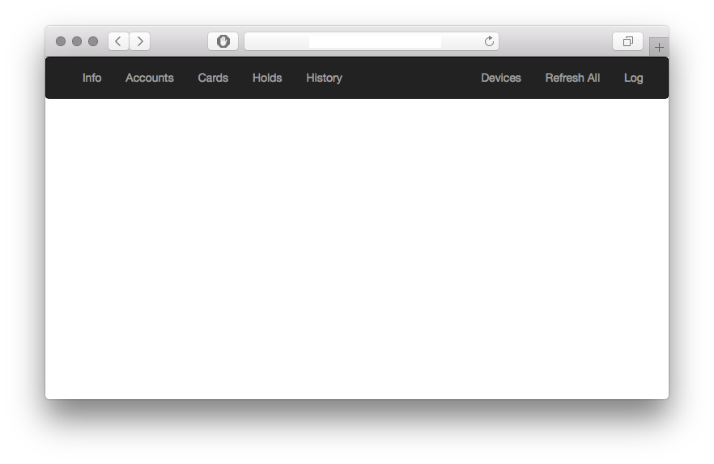

# What Is This
- This is a web client for Raiffaisen Bank UA.
- It was reverse-engineered from an iPhone application.

https://online.aval.ua/bfo/channel/web/loginframe.jsp



# How To Use
0. This project requires ```python3``` to run.
1. Create file `credentials.py` in ```rfua_api``` folder with this content:
```python
string = {"Login":"LOGIN_STRING","Password":"PASSWORD_STRING"}
```
2. The project is build on flask framework. If you don't have it, install via ```pip3 install flask```.
3. Run ```FLASK_APP=main.py flask run --host=0.0.0.0``` in root folder
4. Go to ```http://localhost:5000/rfsn``` in your web browser

# How API Works
1. Launch ```python3``` shell in root and issue
```
import rfua_api.main as api
```
2. New object ```api.session``` will be created
3. Object initialization creates session with RF UA API and fetches all availible info
4. Data is accessible from these objects:
	- main.session.Info
	- main.session.Cards
	- main.session.Accounts
	- main.session.Holds
	- main.session.History
5. When the object is deleted, destructor method performs logoff

# Other Info
The API interface at ```online.aval.ua``` is very unstable.

That's why every request is performed in a loop with timeout counter.

Counter can be configured in ```config.py```